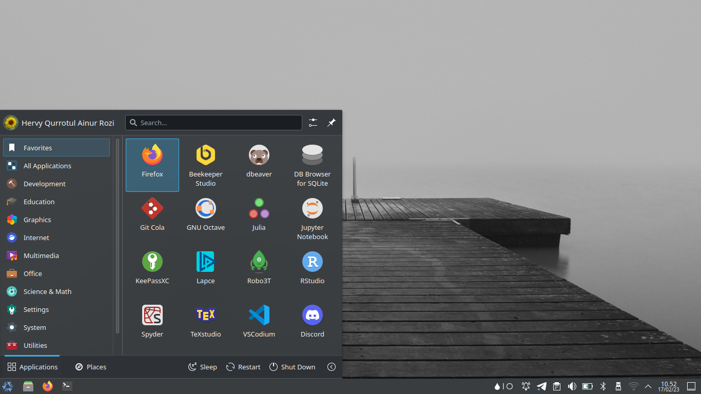

# Data Science



Minimalist configuration of Nixos operating system with KDE Plasma Wayland (disk encrypted) for Data Science needs.

## Installation

```sh
git clone git@gitlab.com:hervyqa/nixos-config.git
cd nixos-config
```

Symlink to `/etc/nixos`.

```sh
sudo mv configuration.nix configuration.nix.bak
sudo ln -s $PWD/configuration.nix /etc/nixos/
```

Replace the variables below according to your data in `configuration.nix`.

```nix
let
  name = "hervyqa";
  fullname = "Hervy Qurrotul Ainur Rozi";
  email = "hervyqa@proton.me";
  timezone = "Asia/Jakarta";
  defaultlocale = "en_US.UTF-8";
  extralocale = "id_ID.UTF-8";
  layout = "us";
  gpgkey = "85161EB8";
in
```

## NixOS Info

- system: `"x86_64-linux"`
- host os: `Linux 5.15.89, NixOS, 22.11 (Raccoon), 22.11.1777.cdead16a444`
- multi-user?: `yes`
- sandbox: `yes`
- version: `nix-env (Nix) 2.11.1`
- channels(hervyqa): `""`
- channels(root): `"nixos-22.11"`
- nixpkgs: `/nix/var/nix/profiles/per-user/root/channels/nixos`

### Settings

| Configuration                             |
| :---------------------------------------- |
| `vm.swappiness = 10;`                     |
| `tmpOnTmpfs = true;`                      |
| `defaultUserShell = pkgs.fish;`           |
| `auto-optimise-store = true;`             |
| `allowUnfree = true;`                     |
| `adb.enable = true;`                      |
| `dconf.enable = true;`                    |
| `gamemode.enable = true;`                 |
| `java.enable = true;`                     |
| `kdeconnect.enable = true;`               |
| `light.enable = true;`                    |
| `mtr.enable = true;`                      |
| `enablePlasmaBrowserIntegration = false;` |
| `autoLogin.enable = true;`                |
| `dnscrypt-proxy2.enable = true;`          |
| `earlyoom.enable = true;`                 |
| `fstrim.enable = true;`                   |
| `mysql.enable = true;`                    |
| `postgresql.enable = true;`               |
| `pipewire.enable = true;`                 |
| `thermald.enable = true;`                 |
| `doas.enable = true;`                     |
| `sudo.enable = false;`                    |
| `systemd.oomd.enable = false;`            |
| `defaultSession = "plasmawayland";`       |
| `bluetooth.hsphfpd.enable = true;`        |
| `opengl.extraPackages = amdvlk`           |
| `kernelModules = ["amdgpu"];`             |
| `autoUpgrade.enable = true;`              |
| `system.stateVersion = "22.11";`          |

## Data science

### R

The list of installed `R` packages is in the `rstudioWrapper.override` section:

```sh
rstudioWrapper.override {
  packages = with rPackages; [
    ...
    ]
  }
```

<details>
<summary><b>See all module list of R.</b></summary>

```sh
Cairo
DT
DataExplorer
JuliaCall
JuliaConnectoR
MASS
RANN
RColorBrewer
Rcpp
XML
baseline
beepr
blogdown
bookdown
bookdownplus
caret
colourpicker
dataCompareR
data_table
datapasta
devtools
diffobj
dplyr
duckdb
dygraphs
echarts4r
esquisse
flexdashboard
forecast
foreign
freqparcoord
fst
geofacet
ggiraph
ggplot2
glue
gmodels
gridExtra
gym
here
httr
installr
janitor
jsonlite
knitr
leaflet
listviewer
lme4
lubridate
magrittr
mapsapi
officer
openNLP
openxlsx
optparse
pacman
paletteer
patchwork
plotly
plumber
profvis
purrr
quantmod
quarto
r5r
reactable
readr
readxl
remedy
remotes
reshape2
reticulate
rio
rmarkdown
roxygen2
rvest
scales
sf
shiny
shinyjs
spatstat
splitstackshape
sqldf
stringr
tensorflow
testthat
tidycensus
tidygeocoder
tidymodels
tidyquant
tidyr
tidytext
tidyverse
tidyxl
tmap
tmaptools
tsbox
usethis
validate
vetiver
vroom
xts
yaml
ymlthis
zoo
```

</details>

### Python3

The list of installed `python3` packages is in the `python3.withPackages` section:

```sh
python3.withPackages (
  ps:
    with ps; [
      ...
    ]
  )
```

<details>
<summary><b>See the Python3 library.</b></summary>

```sh
Theano
av
baseline
beautifulsoup4
bokeh
click
cython
dash
dask
datasette
dill
duckdb
flask
future
gym
h5py
ibm-watson
imbalanced-learn
ipykernel
ipython
ipywidgets
jedi
jedi-language-server
joblib
jupyter
jupyterlab
jupyterlab-lsp
jupyterlab-pygments
keras
lightgbm
mahotas
matplotlib
moviepy
mypy
nbdime
networkx
nltk
nose
numpy
opencv4
openpyxl
pandas
pillow
pims
plotly
plotnine
pydot
pyls-spyder
pyspark
pytest
pytorch
pyyaml
qdarkstyle
requests
sagemaker
scikit-learn
scikitimage
scipy
scrapy
seaborn
selenium
spacy
spyder
spyder-kernels
statsmodels
sympy
tableaudocumentapi
tables
tensorflow
tensorflow-metadata
tensorflow-probability
tifffile
torch
torchvision
tqdm
trfl
virtualenv
virtualenvwrapper
wordcloud
xarray
yt-dlp
```

</details>

### SQL

* MariaDB & PostgreSQL enables by default, `mysql.enable = true;`, `postgresql.enable = false;`.
* Mongodb is disabled `mongodb.enable = false;`.

### Other programming languages

In addition to `R` and `python3`, there are also `julia`, `rakudo`, and `scala`.

## IDE

### Spyder

Especially for python programming. This package is included in the `python3.withPackages` section above and is already integrated with the pandas, numpy, matplotlib, scikit-learn, and other libraries.

### VSCodium

List of installed vscodium plugins (configuration.nix):

```sh
vscode-with-extensions.override {
  vscode = vscodium;
  vscodeExtensions = with vscode-extensions; [
    ...
    ]
  }
```

<details>
<summary><b>See the VSCodium extensions.</b></summary>

```sh
azdavis.millet
b4dm4n.vscode-nixpkgs-fmt
bbenoist.nix
bmalehorn.vscode-fish
davidanson.vscode-markdownlint
editorconfig.editorconfig
esbenp.prettier-vscode
formulahendry.code-runner
grapecity.gc-excelviewer
kamadorueda.alejandra
mechatroner.rainbow-csv
mhutchie.git-graph
ms-pyright.pyright
ms-python.python
ms-toolsai.jupyter
ms-toolsai.jupyter-keymap
ms-toolsai.jupyter-renderers
ms-toolsai.vscode-jupyter-cell-tags
ms-toolsai.vscode-jupyter-slideshow
ms-vscode.anycode
pkief.material-icon-theme
scala-lang.scala
shardulm94.trailing-spaces
shd101wyy.markdown-preview-enhanced
streetsidesoftware.code-spell-checker
```

</details>

### Others

In addition to `spyder`, `vscodium`, `hx` there are also other gui applications such as:

- `dbeaver` database processor.
- `octaveFull` numerical calculation matlab.
- `sqlitebrowser` sqlite database processor.
- `texstudio` document processor `LaTex`.
- `paraview` data visualization.
- `wxmaxima` numerical calculations.

Other tools:

- `clickhouse`
- `gnuplot`
- `grafana`
- `jupyter`
- `jupyterlab`
- `kaggle`
- `luigi`
- `metabase`
- `tabula`
- `visidata`

## License

MIT License

Copyright (c) 2023 Hervy Qurrotul Ainur Rozi
