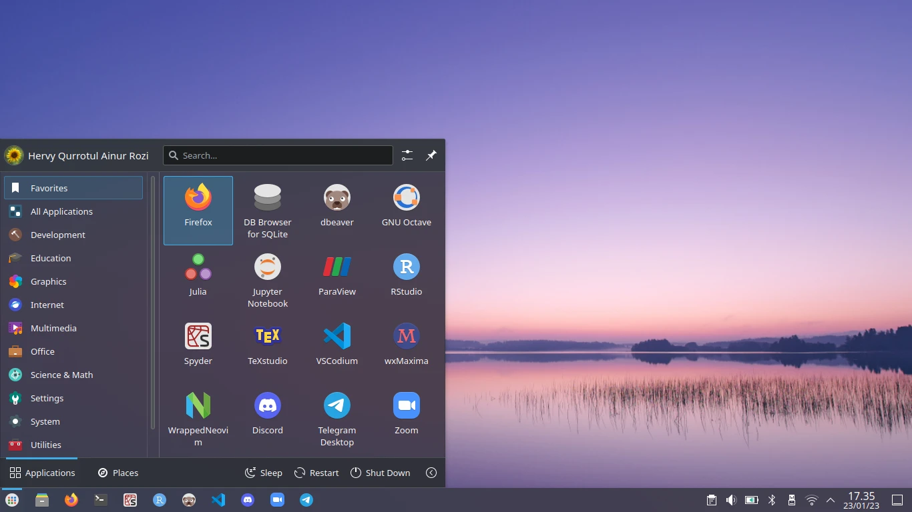

# Data Sains



Konfigurasi minimalis sistem operasi Nixos dengan KDE Plasma Wayland (disk encrypted) untuk kebutuhan Data Sains.

## Pemasangan

```sh
git clone git@gitlab.com:hervyqa/nixos-config.git
cd nixos-config
```

Symlink ke `/etc/nixos`.

```sh
sudo mv configuration.nix configuration.nix.bak
sudo ln -s $PWD/configuration.nix /etc/nixos/

```

Ganti variabel dibawah ini sesuai dengan data Anda di `configuration.nix`.

```nix
}: let
  name = "hervyqa";
  fullname = "Hervy Qurrotul Ainur Rozi";
  email = "hervyqa@proton.me";
  timezone = "Asia/Jakarta";
  defaultlocale = "en_US.UTF-8";
  extralocale = "id_ID.UTF-8";
  layout = "us";
in {
```

## Info Mesin

```sh
➜  nix-info -m
 - system: `"x86_64-linux"`
 - host os: `Linux 5.15.89, NixOS, 22.11 (Raccoon), 22.11.1777.cdead16a444`
 - multi-user?: `yes`
 - sandbox: `yes`
 - version: `nix-env (Nix) 2.11.1`
 - channels(hervyqa): `""`
 - channels(root): `"nixos-22.11"`
 - nixpkgs: `/nix/var/nix/profiles/per-user/root/channels/nixos`
```

### Pengaturan

| Konfigurasi                               | Deskripsi                                                              |
| :---------------------------------------- | :--------------------------------------------------------------------- |
| `vm.swappiness = 10;`                     | Nilai swappines.                                                       |
| `tmpOnTmpfs = true;`                      | Pengunaan tmpfs.                                                       |
| `defaultUserShell = pkgs.fish;`           | Fish sebagai shell utama.                                              |
| `auto-optimise-store = true;`             | Optimasi berkas/direktori nix store agar penggunaan disk yang minimal. |
| `allowUnfree = true;`                     | Perizinan memasang aplikasi nonfree.                                   |
| `adb.enable = true;`                      | Menyambungkan perangkat Android.                                       |
| `dconf.enable = true;`                    | Mengaktifkan tema GTK.                                                 |
| `gamemode.enable = true;`                 | Mengaktifkan layanan `gamemode`.                                       |
| `java.enable = true;`                     | Lingkungan java.                                                       |
| `kdeconnect.enable = true;`               | Fitur kde connect untuk transfer berkas secara intan.                  |
| `light.enable = true;`                    | Pengatur kecerahan dengan cli.                                         |
| `mtr.enable = true;`                      | Mengaktifkan perkakas diagnosa jaringan.                               |
| `neovim.defaultEditor = true;`            | Penyunting teks cli utama adalah neovim.                               |
| `enablePlasmaBrowserIntegration = false;` | Menonaktifkan integrasi firefox dengan plasma                          |
| `autoLogin.enable = true;`                | Otomatis login saat pertama kali booting.                              |
| `dnscrypt-proxy2.enable = true;`          | Mengaktifkan layanan enkripsi dns.                                     |
| `earlyoom.enable = true;`                 | Mengaktifkan layanan jika terjadi limit memori.                        |
| `fstrim.enable = true;`                   | Mengaktifkan layanan periodik trim SSD.                                |
| `mysql.enable = true;`                    | Mengaktifkan layanan mysql basisdata.                                  |
| `pipewire.enable = true;`                 | Mengaktifkan layanan pipewire audio.                                   |
| `thermald.enable = true;`                 | Mengaktifkan layanan thermald pengatur suhu.                           |
| `doas.enable = true;`                     | Mengaktifkan program doas pengganti sudo.                              |
| `sudo.enable = false;`                    | Menghapus program sudo.                                                |
| `systemd.oomd.enable = false;`            | Menonaktifkan layanan systemd-oom karena sudah menggunakan earlyoom.   |
| `defaultSession = "plasmawayland";`       | Plasms Wayland sebagai sesi utama.                                     |
| `bluetooth.hsphfpd.enable = true;`        | Mengaktifkan fitur hsphfpd bluetooth.                                  |
| `opengl.extraPackages = amdvlk`           | Menambahkan ekstra paket untuk dukungan vulkan.                        |
| `kernelModules = ["amdgpu"];`             | Kernel modul tambahan `amdgpu`. (`hardware-configuration.nix`)         |
| `system.stateVersion = "22.11";`          | Versi NixOS yang digunakan.                                            |

## Data science

### R

Daftar paket `R` yang terinstall ada di bagian `rstudioWrapper.override`:

```sh
rstudioWrapper.override {
  packages = with rPackages; [
    ...
    ]
  }
```

<details>
<summary><b>Lihat pustaka R.</b></summary>

```sh
Cairo
DT
DataExplorer
JuliaCall
JuliaConnectoR
MASS
RANN
RColorBrewer
Rcpp
XML
beepr
colourpicker
dataCompareR
data_table
datapasta
devtools
diffobj
dplyr
dygraphs
echarts4r
esquisse
flexdashboard
forecast
foreign
freqparcoord
fst
geofacet
ggiraph
ggplot2
glue
gmodels
gridExtra
here
httr
installr
janitor
jsonlite
knitr
leaflet
listviewer
lme4
lubridate
magrittr
mapsapi
officer
openxlsx
optparse
pacman
paletteer
patchwork
plotly
plumber
profvis
purrr
quantmod
reactable
readr
readxl
remedy
remotes
reshape2
reticulate
rio
rmarkdown
roxygen2
rvest
scales
sf
shiny
shinyjs
spatstat
splitstackshape
sqldf
stringr
testthat
tidycensus
tidygeocoder
tidymodels
tidyquant
tidyr
tidytext
tidyverse
tidyxl
tmap
tmaptools
tsbox
usethis
validate
vroom
xts
yaml
ymlthis
zoo
```

</details>

### Python3

Daftar paket `python3` yang terinstall ada di bagian `python3.withPackages`:

```sh
python3.withPackages (
  ps:
    with ps; [
      ...
    ]
  )
```

<details>
<summary><b>Lihat pustaka Python3.</b></summary>

```sh
Theano
beautifulsoup4
bokeh
cython
click
dask
datasette
dill
flask
future
h5py
imbalanced-learn
ipykernel
ipython
ipywidgets
jedi
jedi-language-server
joblib
jupyter
jupyterlab
jupyterlab-lsp
jupyterlab-pygments
keras
lightgbm
mahotas
matplotlib
moviepy
mypy
nbdime
networkx
nltk
nose
numpy
opencv4
openpyxl
pandas
pillow
pims
plotly
plotnine
pydot
pyls-spyder
pynvim
pytest
pytorch
pyyaml
qdarkstyle
requests
scikit-learn
scikitimage
scipy
scrapy
seaborn
selenium
spacy
spyder
spyder-kernels
statsmodels
tableaudocumentapi
tables
tensorflow
tensorflow-metadata
tensorflow-probability
tifffile
torch
torchvision
tqdm
trfl
virtualenv
virtualenvwrapper
wordcloud
xarray
```

</details>

### Pemrograman lainnya

Selain `R` dan `python3`, juga sudah terdapat `julia`, `rakudo`, dan `scala`

## IDE

### Spyder

Khusus untuk pemrograman python. Paket ini sudah termasuk di bagian `python3.withPackages` diatas dan sudah terintegrasi dengan pustaka pandas, numpy, matplotlib, scikit-learn, dan lain-lain.

### VSCodium

Daftar plugin vscodium yang terinstall (configuration.nix):

```sh
vscode-with-extensions.override {
  vscode = vscodium;
  vscodeExtensions = with vscode-extensions; [
    ...
    ]
  }
```

<details>
<summary><b>Lihat ekstensi VSCodium.</b></summary>

```sh
azdavis.millet
b4dm4n.vscode-nixpkgs-fmt
bbenoist.nix
bmalehorn.vscode-fish
davidanson.vscode-markdownlint
editorconfig.editorconfig
esbenp.prettier-vscode
formulahendry.code-runner
grapecity.gc-excelviewer
kamadorueda.alejandra
mechatroner.rainbow-csv
mhutchie.git-graph
ms-pyright.pyright
ms-python.python
ms-toolsai.jupyter
ms-toolsai.jupyter-keymap
ms-toolsai.jupyter-renderers
ms-toolsai.vscode-jupyter-cell-tags
ms-toolsai.vscode-jupyter-slideshow
ms-vscode.anycode
pkief.material-icon-theme
scala-lang.scala
shardulm94.trailing-spaces
shd101wyy.markdown-preview-enhanced
streetsidesoftware.code-spell-checker
```

</details>

### Neovim

Manajemen plugin neovim menggunakan `coc-nvim`. Daftar plugin yang terinstall ada di bagian `neovim.override`:

```sh
neovim.override {
  ...
    packages.myPlugins = with pkgs.vimPlugins; {
      start = [
        ...
    ]
  }
}
```

<details>
<summary><b>Lihat plugin Neovim.</b></summary>

```sh
coc-clangd
coc-clap
coc-cmake
coc-css
coc-denite
coc-diagnostic
coc-docker
coc-emmet
coc-eslint
coc-explorer
coc-flutter
coc-fzf
coc-git
coc-go
coc-haxe
coc-highlight
coc-html
coc-java
coc-jest
coc-json
coc-lists
coc-lua
coc-markdownlint
coc-metals
coc-neco
coc-nginx
coc-nvim
coc-pairs
coc-prettier
coc-pyright
coc-python
coc-r-lsp
coc-rls
coc-rust-analyzer
coc-sh
coc-smartf
coc-snippets
coc-solargraph
coc-spell-checker
coc-sqlfluff
coc-stylelint
coc-sumneko-lua
coc-svelte
coc-tabnine
coc-tailwindcss
coc-texlab
coc-toml
coc-tslint
coc-tslint-plugin
coc-tsserver
coc-ultisnips
coc-vetur
coc-vimlsp
coc-vimtex
coc-wxml
coc-yaml
coc-yank
julia-vim
scope-nvim
scrollbar-nvim
statix
surround-nvim
tabline-nvim
vim-airline
vim-airline-themes
vim-commentary
vim-lastplace
vim-lightline-coc
vim-nix
vim-wayland-clipboard
```

</details>

### Lainnya

Selain `spyder`, `vscodium`, `neovim` juga terdapat aplikasi gui lainnya seperti:

- `dbeaver` pengolah basis data.
- `octaveFull` perhitungan numerik matlab.
- `sqlitebrowser` pengolah basis data sqlite.
- `texstudio` pengolah dokumen `LaTex`.
- `paraview` visualisasi data.
- `wxmaxima` perhitungan numerik.

Aplikasi cli:

- `clickhouse`
- `duckdb`
- `gnuplot`
- `grafana`
- `kaggle`
- `luigi`
- `metabase`
- `tabula`
- `visidata`

## Lisensi

MIT License

Copyright (c) 2023 Hervy Qurrotul Ainur Rozi
